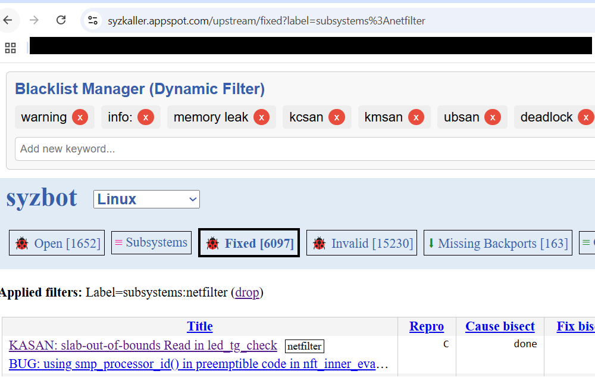

$${\color{green}警告：该项目的 README 和代码几乎由 GPT-4o 与 GPT-01 自动生成，包括蔡徐坤相关的梗（我也不清楚 GPT 为什么会加这个）。}$$

$${\color{green} 凡由碳基生物撰写的文档（如这一部分）将以绿色标示。本文档的图片亦由碳基生物亲自截图。}$$

# SyzbotFilter

🎯 **SyzbotFilter** 是一个为 [syzkaller.appspot.com](https://syzkaller.appspot.com/) 上的漏洞列表页面量身定制的 Greasemonkey / Tampermonkey 用户脚本。  
它支持基于关键词的黑名单过滤，并对大量表格数据进行**批处理优化**，避免浏览器“卡成 PPT”甚至直接去世。

---

## 🔧 功能简介

- ✂️ 关键词黑名单过滤漏洞条目（匹配标题）
- ⚡ 高性能分批过滤，避免一次性卡死页面
- ⌨️ 支持 **Enter键** 添加关键词
- ♻️ 黑名单永久保存（使用 localStorage）
- 👀 Loading 提示，过滤时不慌张
- 💾 动态更新，无需刷新页面

---

## 📦 安装方法

1. 安装 [Tampermonkey](https://www.tampermonkey.net/) 或 [Greasemonkey](https://www.greasespot.net/)  
2. 打开脚本地址：[syzbotfilter.js](https://github.com/TomAPU/SyzbotFilter/blob/master/syzbotfilter.js)  
3. 点击 **Raw** → Tampermonkey 会提示安装 → Confirm 安装即可  
4. 浏览器访问 [`https://syzkaller.appspot.com/upstream`](https://syzkaller.appspot.com/upstream) 页面测试！

---

## 📍 注意事项

- 默认**跳过超大页面** [`/upstream/fixed/`](https://syzkaller.appspot.com/upstream/fixed/)，防止浏览器爆炸
- 可自定义 `@match` 和 `@exclude` 控制脚本生效范围  $${\color{green}（这部分是油猴插件脚本自己支持的事情，不要信 AI 在这里说的话。）}$$
- 黑名单匹配为**不区分大小写**

---

## 📸 截图演示

---

## 🧌 维护声明

> 这个脚本完全由 **ChatGPT** 生成，遇到问题请找 ChatGPT，**不要找作者**！  
> 作者只负责吃瓜和用脚本，不负责修 bug 😎  
> —— 有问题请点击：https://chat.openai.com/

---

## 🥚 彩蛋功能？  
> 彩蛋未上线，考虑支持“你干嘛 哎呦”音效 💿  
> 欢迎 PR，或者继续艾特 ChatGPT 让它写 🐱‍🏍

---

## 📄 License

MIT License — 自由使用，欢迎修改、PR 和甩锅 😈

<h2>GPT对话记录</h2>

和GPT的对话记录已上传至conversation.md

